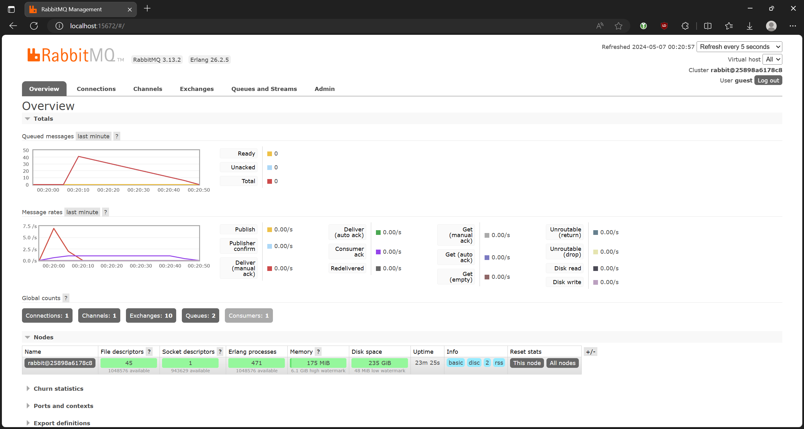
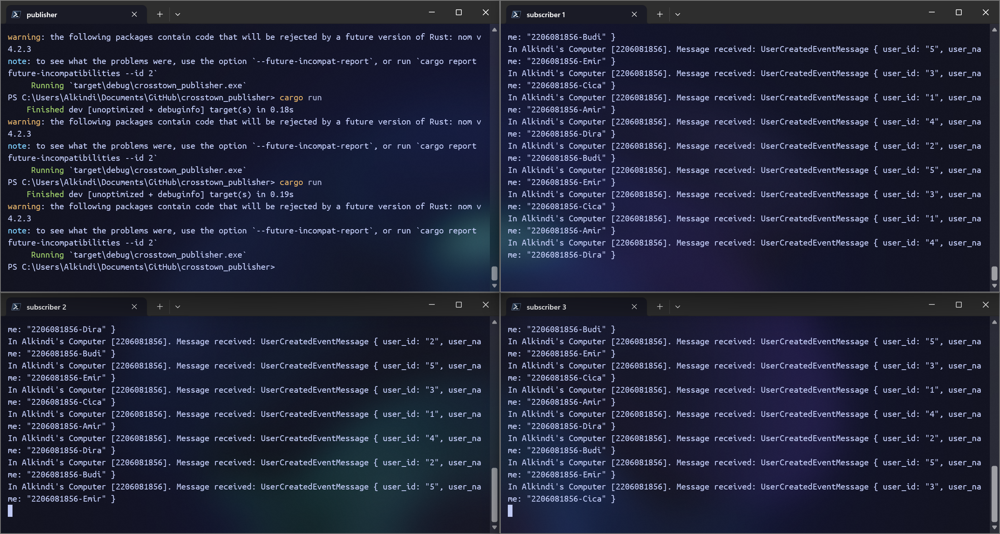
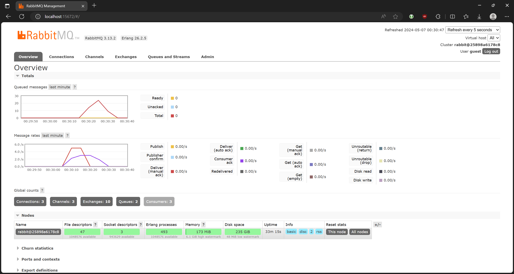

# Tutorial 8 - Subscriber

## Questions

> what is `amqp`?

A: amqp is short for Advanced Message Querying Protocol.
It serves as a network protocol to help with message transfer between services.
In our case, we will be using it to transfer messages between `subscriber` and `publisher`

> what it means? `guest:guest@localhost:5672`
> what is the first `quest`, and what is the second `guest`,
> and what is `localhost:5672` is for?

A:

- `guest` (1): username for authentication
- `guest` (2): password for `guest`
- `localhost:5672`: IP address and port where RabbitMQ is running. We're using `localhost` to refer to our local machine

Slow subscriber simulation:  

As we can see, there's a spike where there are 41 messages at one point.
`thread::sleep(ten_millis)` caused each event sent by the publisher to take an extra 1 second when being processed by the subscriber.
This caused the sent events to queue up and not process as quickly as it could. The publisher is also run 9 times to simulate multiple slow users.

Multiple subscriber simulation:  

## Reflection

By connecting 3 subscribers to the same queue, we can see that the event processing is sped up as the workload is spread between the 3 of them.
The publisher is run 10 times, yet the event queue is processed quicker than the previous simulation.
We can improve Subscriber by removing `thread::sleep(ten_millis)` and use threads to process multiple events at once
As for Publisher, we can improve it by sending events asynchronously and sending them in a batch.
These changes will make sending and processing events less linear, thus minimizing the impact of a slow subscriber and speeding up the process.
